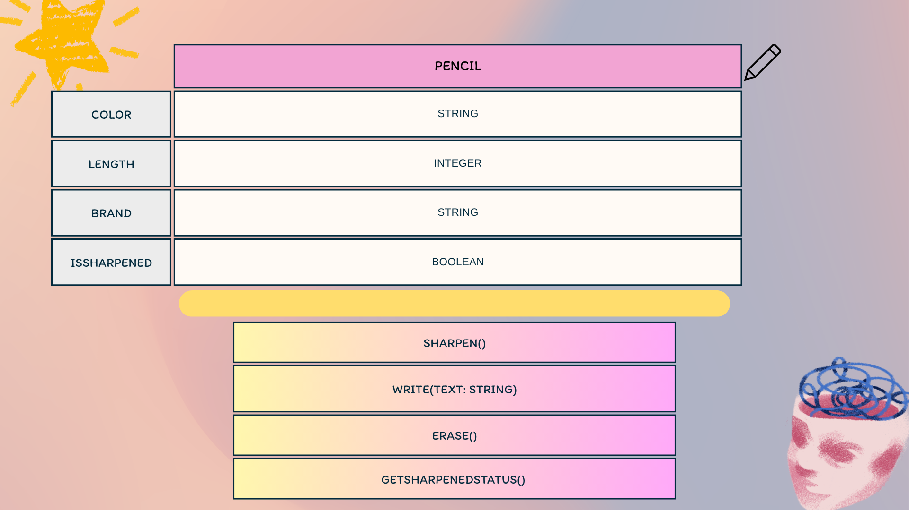

# Class Attributes and Methods
## Previous Design
Link to my previous activity:
[classObjectUML.md](https://github.com/mkssaltorio-stack/9siliconcs3/blob/main/q1/MyOOPseedSystem/classObjectUml.md)
## Design Revision
- No major changes were needed from my original design.
## Visibility Decisions
| Attribute | Data Type | Visibility | Reason |
|---|---|---|---|
| color | String | public | The color can be accessed and changed when needed. |
| length | Integer | public | The length can be accessed to know how long the pencil is. |
| brand | String | public | The brand can be accessed to identify the pencil. |
| isSharpened | Boolean | private | It should be protected so it can only be changed through the appropriate method. |
## Updated UML Class Diagram

## Python Implementation

[View Python Source](classimplementation.py)
## Test Run

## Object Diagram

## Analysis
### Why did you make your chosen attribute private?
- I made isSharpened private because it keeps the pencil's sharpened state protected. If another part of the program changed it directly, the value could become incorrect. Using a method to change it makes the object easier to control.

### Which method changes the state of your object?
- The sharpen() method changes the state of the pencil. It changes the isSharpened attribute from false to true. This shows that the method can safely modify the private attribute.

### How did your two objects demonstrate that instances are independent?
- I created two different Pencil objects with different values. When I called sharpen() on the first pencil, only its isSharpened value changed. The second pencil kept its original state, showing that the objects are independent.

### What is the difference between your class diagram and your object diagram?
- The class diagram shows the blueprint of the Pencil class, including its attributes, data types, visibility, and methods. The object diagram shows the actual Pencil objects created from that class. It contains the specific values of each object's attributes after the program runs.
